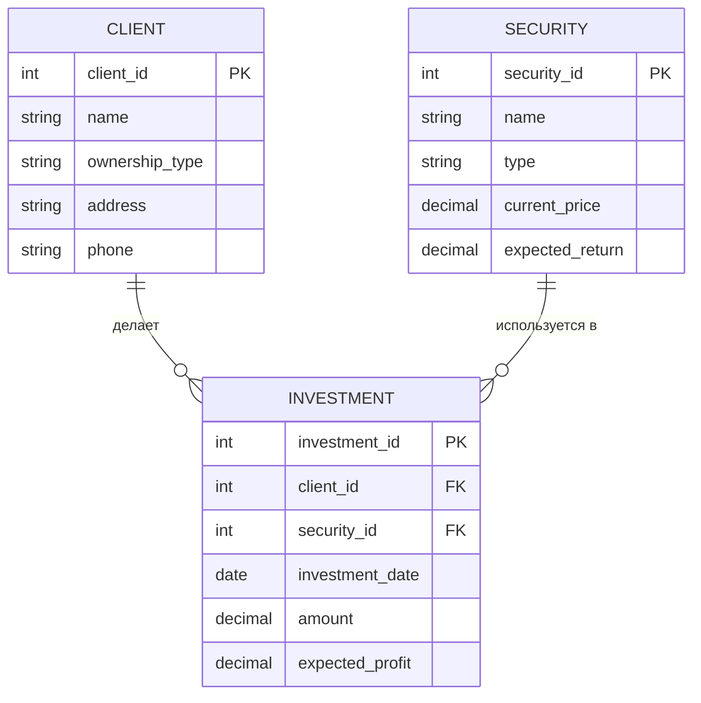
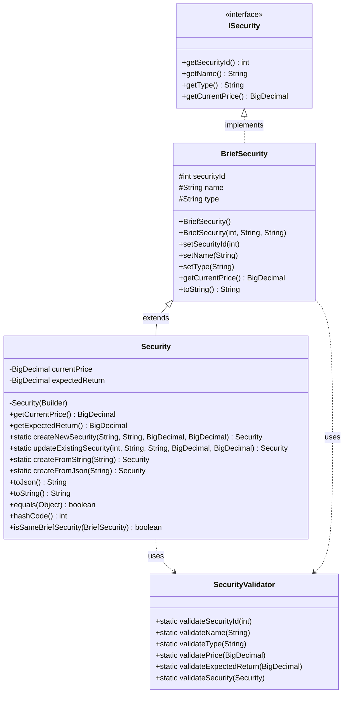
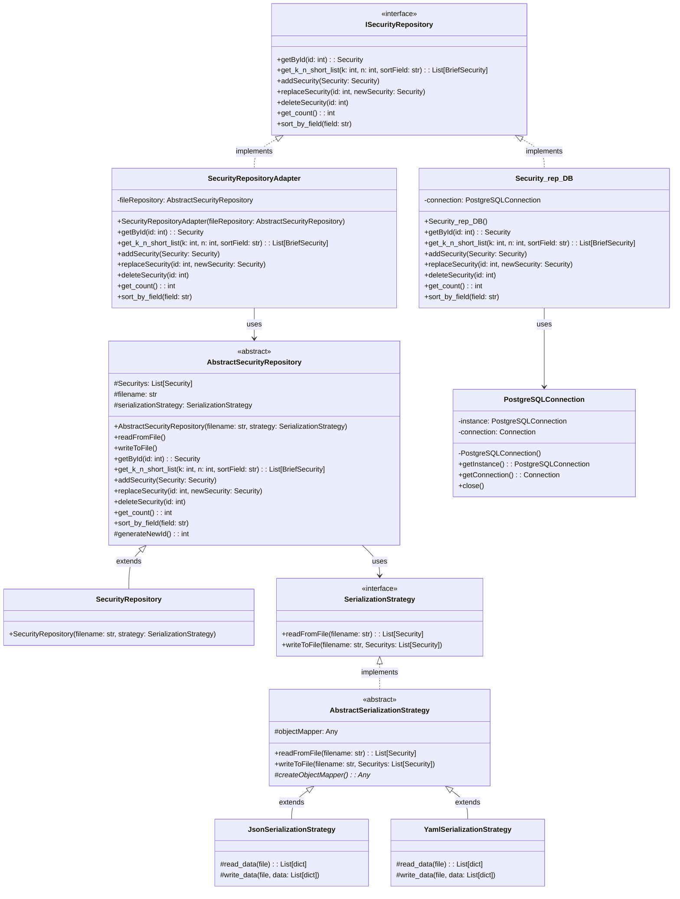
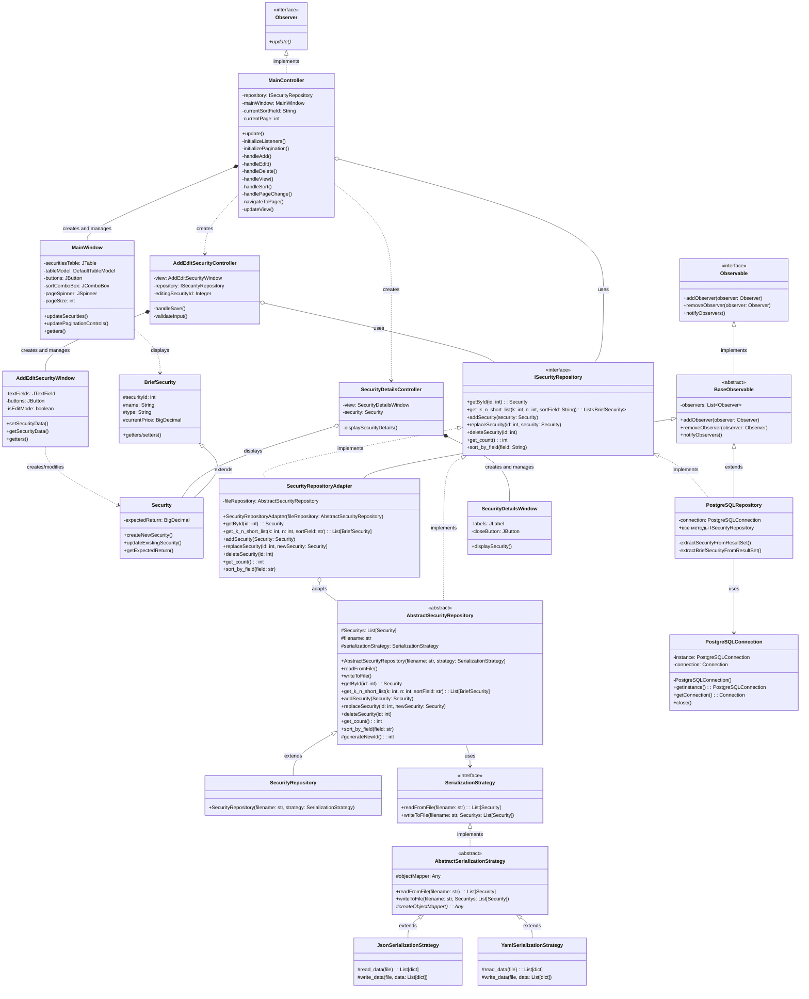

## ER-диаграмма

## Описание таблиц

1. **CLIENT (Клиент)**:
   - client_id: уникальный идентификатор клиента (первичный ключ)
   - name: название предприятия
   - ownership_type: вид собственности
   - address: адрес предприятия
   - phone: телефон предприятия

2. **SECURITY (Ценная бумага)**:
   - security_id: уникальный идентификатор ценной бумаги (первичный ключ)
   - name: название ценной бумаги
   - type: тип ценной бумаги (акция, облигация и т.д.)
   - current_price: текущая цена
   - expected_return: ожидаемая доходность

3. **INVESTMENT (Инвестиция)**:
   - investment_id: уникальный идентификатор инвестиции (первичный ключ)
   - client_id: внешний ключ, связывающий с таблицей CLIENT
   - security_id: внешний ключ, связывающий с таблицей SECURITY
   - investment_date: дата инвестиции
   - amount: сумма инвестиции
   - expected_profit: ожидаемая прибыль

## Выбранная таблица для дальнейшей работы:
**Таблица SECURITY - Ценная бумага**

## Диаграмма классов

## Структура проекта

## Диаграмма взаимодействия компонентов

```mermaid
sequenceDiagram
    participant User
    participant Main as Main:main()
    participant MainController as MainController:controller
    participant MainWindow as MainWindow:main_window
    participant Repository as Repository:repository_adapter
    participant AddEditController as AddEditController:controller
    participant AddEditWindow as AddEditWindow:add_window/edit_window
    participant DetailsController as DetailsController:controller
    participant DetailsWindow as DetailsWindow:details_window
    
    %% Инициализация приложения
    rect rgb(200, 220, 240)
    Note over User,DetailsWindow: Инициализация приложения
    User->>+Main: main()
    Main->>+Repository: createFileRepository()
    Note right of Repository: FileRepository + Adapter<br/>или PostgreSQLRepository
    Repository-->>-Main: return repository
    Main->>+MainController: MainController(repository)
    MainController->>MainWindow: MainWindow()
    MainWindow-->>MainController: return window
    MainController->>Repository: add_observer(self)
    MainController->>MainController: initializePagination()
    MainController->>Repository: get_k_n_short_list(k, n, sort_field)
    Repository-->>MainController: return securities[]
    MainController->>MainWindow: update_products(securities, total_items)
    MainController->>MainWindow: updatePaginationControls()
    MainWindow-->>User: display UI
    end

    %% Добавление ценной бумаги
    rect rgb(220, 240, 220)
    Note over User,DetailsWindow: Добавление новой ценной бумаги
    User->>MainWindow: click add_button
    MainWindow->>MainController: handle_add()
    MainController->>+AddEditWindow: AddEditWindow(parent, is_edit=false)
    MainController->>+AddEditController: AddEditController(view, repository)
    AddEditWindow-->>User: display form
    User->>AddEditWindow: input data
    User->>AddEditWindow: click save_button
    AddEditWindow->>AddEditController: handle_save(data)
    AddEditController->>AddEditController: validate_data()
    Note right of AddEditController: Использование SecurityValidator
    AddEditController->>Repository: addSecurity(security)
    Repository->>Repository: notifyObservers()
    Repository->>MainController: update()
    MainController->>Repository: get_k_n_short_list(k, n, sort_field)
    Repository-->>MainController: return securities[]
    MainController->>MainWindow: update_products(securities, total_items)
    MainController->>MainWindow: updatePaginationControls()
    MainWindow-->>User: update UI
    AddEditWindow-->>User: destroy()
    end

    %% Редактирование ценной бумаги
    rect rgb(240, 220, 220)
    Note over User,DetailsWindow: Редактирование ценной бумаги
    User->>MainWindow: select security
    User->>MainWindow: click edit_button
    MainWindow->>MainController: handle_edit()
    MainController->>Repository: getById(security_id)
    Repository-->>MainController: return Security
    MainController->>+AddEditWindow: AddEditWindow(parent, is_edit=true)
    MainController->>+AddEditController: AddEditController(view, repository, security_id)
    AddEditWindow->>AddEditWindow: setSecurityData(security)
    AddEditWindow-->>User: display form
    User->>AddEditWindow: modify data
    User->>AddEditWindow: click save_button
    AddEditWindow->>AddEditController: handle_save(data)
    AddEditController->>AddEditController: validate_data()
    AddEditController->>Repository: replaceSecurity(security_id, security)
    Repository->>Repository: notifyObservers()
    Repository->>MainController: update()
    MainController->>Repository: get_k_n_short_list(k, n, sort_field)
    Repository-->>MainController: return securities[]
    MainController->>MainWindow: update_products(securities, total_items)
    MainController->>MainWindow: updatePaginationControls()
    MainWindow-->>User: update UI
    AddEditWindow-->>User: destroy()
    end

    %% Просмотр деталей
    rect rgb(240, 240, 220)
    Note over User,DetailsWindow: Просмотр деталей ценной бумаги
    User->>MainWindow: select security
    User->>MainWindow: click view_button
    MainWindow->>MainController: handle_view()
    MainController->>Repository: getById(security_id)
    Repository-->>MainController: return Security
    MainController->>+DetailsWindow: SecurityDetailsWindow(parent)
    MainController->>+DetailsController: SecurityDetailsController(view, security)
    DetailsController->>DetailsWindow: displaySecurity(security)
    DetailsWindow-->>User: display details
    User->>DetailsWindow: click close_button
    DetailsWindow-->>User: destroy()
    end

    %% Удаление ценной бумаги
    rect rgb(240, 220, 240)
    Note over User,DetailsWindow: Удаление ценной бумаги
    User->>MainWindow: select security
    User->>MainWindow: click delete_button
    MainWindow->>MainController: handle_delete()
    MainController->>MainWindow: show_confirmation("Are you sure...")
    MainWindow-->>User: messagebox.askyesno()
    User->>MainWindow: confirm
    MainWindow->>MainController: return True
    MainController->>Repository: deleteSecurity(security_id)
    Repository->>Repository: notifyObservers()
    Repository->>MainController: update()
    MainController->>MainController: checkPageBounds()
    Note right of MainController: Проверка и корректировка<br/>текущей страницы
    MainController->>Repository: get_k_n_short_list(k, n, sort_field)
    Repository-->>MainController: return securities[]
    MainController->>MainWindow: update_products(securities, total_items)
    MainController->>MainWindow: updatePaginationControls()
    MainWindow-->>User: update UI
    end

    %% Пагинация
    rect rgb(220, 240, 240)
    Note over User,DetailsWindow: Пагинация
    User->>MainWindow: click prev/next или<br/>изменить spinner
    MainWindow->>MainController: handle_page_change()
    MainController->>MainController: navigateToPage(new_page)
    MainController->>MainController: calculateTotalPages()
    MainController->>Repository: get_k_n_short_list(k, n, sort_field)
    Repository-->>MainController: return securities[]
    MainController->>MainWindow: update_products(securities, total_items)
    MainController->>MainWindow: updatePaginationControls()
    MainWindow-->>User: update UI
    end

    %% Сортировка
    rect rgb(220, 220, 240)
    Note over User,DetailsWindow: Сортировка
    User->>MainWindow: select sort_combobox
    MainWindow->>MainController: handle_sort(event)
    MainController->>Repository: get_k_n_short_list(k, n, sort_field)
    Repository-->>MainController: return securities[]
    MainController->>MainWindow: update_products(securities, total_items)
    MainController->>MainWindow: updatePaginationControls()
    MainWindow-->>User: update UI
    end
```

## Диаграмма классов
